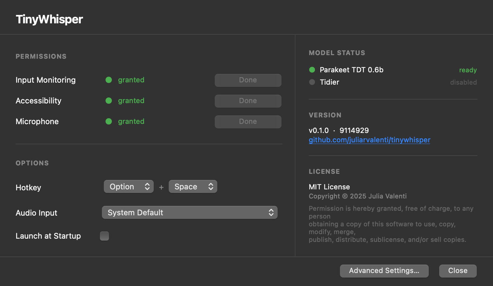
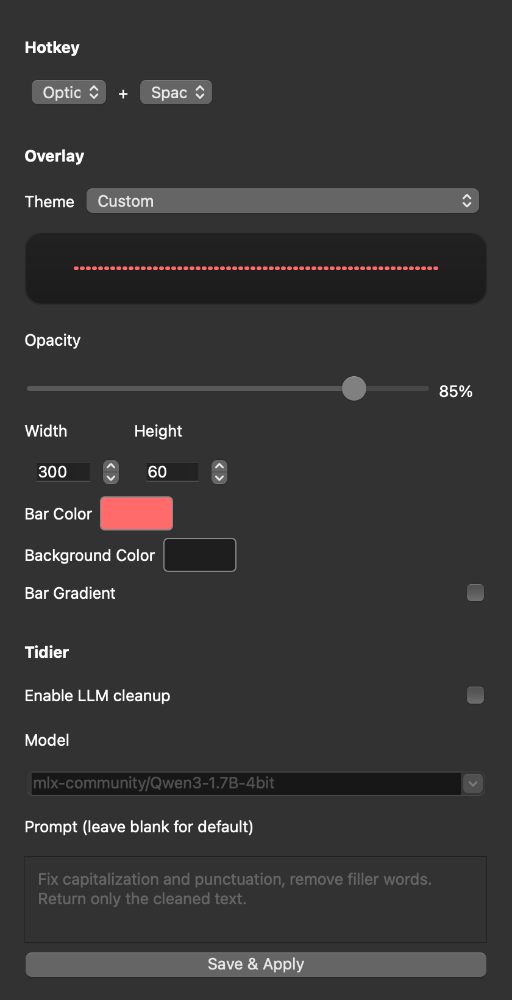

<p align="center">
  
</p>

# TinyWhisper

Local voice-to-text for macOS Apple Silicon. Press a hotkey, speak, and the transcription is pasted at your cursor.

Runs entirely on-device using [MLX](https://github.com/ml-explore/mlx) — no cloud APIs, no subscriptions.

## Screenshots

| Welcome & Setup | Advanced Settings | Waveform Overlay |
|:-:|:-:|:-:|
|  |  |  |

## Features

- **Fast local transcription** — Parakeet TDT 0.6b via MLX (~70x realtime)
- **Global hotkey** — Option+Space to toggle recording (rebindable)
- **Auto-paste** — transcribed text goes straight to your cursor
- **Waveform overlay** — shows recording status without stealing focus
- **Configurable** — colors, opacity, hotkey, overlay size via settings UI or YAML
- **System tray** — lives in your menu bar with live status, memory usage, and quick access to settings

## Requirements

- macOS on Apple Silicon (M1/M2/M3/M4)
- Python 3.10+

## Install

```bash
pip install .
```

To also install Whisper support:

```bash
pip install ".[whisper]"
```

### macOS .app bundle

Build a native menu-bar app (recommended — gives TinyWhisper its own identity for macOS permissions):

```bash
python3 build_app.py
cp -r TinyWhisper.app /Applications/   # optional
open TinyWhisper.app
```

## Usage

```bash
tinywhisper            # run from terminal
# or
open TinyWhisper.app   # run as native app
```

1. Grant **Input Monitoring**, **Accessibility**, and **Microphone** permissions when prompted
2. Press **Option+Space** to start recording
3. Speak, then press **Option+Space** again
4. Transcription is pasted at your cursor

Right-click the menu bar icon for settings, audio device selection, config file, and status info.

## Configuration

Settings are stored at `~/.config/tinywhisper/config.yaml`. You can edit via the tray menu (Settings or Open Config File) or manually:

```yaml
hotkey:
  modifier: "option"       # option, ctrl, cmd, shift
  key: "space"             # space, tab, f1-f12, etc.

transcription:
  engine: "parakeet"       # or "whisper"
  parakeet:
    model: "mlx-community/parakeet-tdt-0.6b-v3"
  whisper:
    model: "mlx-community/whisper-large-v3-turbo"

recording:
  sample_rate: 16000
  channels: 1
  device: null             # audio input device name, or null for system default

overlay:
  enabled: true
  width: 300
  height: 60
  opacity: 0.85
  color: "#FF6B6B"
  bg_color: "#1E1E1E"
```

## Transcription Engines

| Engine | Model | Speed | Memory |
|--------|-------|-------|--------|
| `parakeet` (default) | Parakeet TDT 0.6b v3 | ~70x realtime | ~600 MB |
| `whisper` | Whisper Large V3 Turbo | ~15-20x realtime | ~1.5 GB |

Models are downloaded from HuggingFace on first run and cached locally.

## License

MIT
